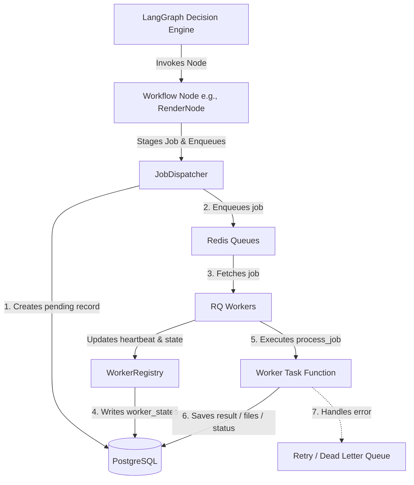

# Zem: Job Queue & Distributed Execution System

Zem features a highly scalable, asynchronous **Job Queue & Distributed Execution System** built on top of **Redis Queue (RQ)**. This system serves as the distributed backbone of our autonomous AI media engine, allowing execution isolation, retry/recovery loops, and parallel workflow staging.

---

## 📐 Architecture & Orchestration

The execution pipeline is split into a **High-Level Orchestrator (LangGraph)** and a **Low-Level Asynchronous Execution Layer (RQ + PostgreSQL)**:

1. **LangGraph (Orchestration & Routing)**: Controls routing, decisions, conditional retries, and overall graph state. It triggers disjointed workflow steps (e.g., `generate_subtitles`, `render_video`).
2. **Job Staging & Dispatching**: Each LangGraph node acts as a thin client that enqueues background jobs via a centralized `JobDispatcher`. The jobs are persisted first in PostgreSQL for staging and tracking, then dispatched to the specific Redis Queue.
3. **Distributed Workers**: Standardized workers fetch tasks from designated Redis queues, report heartbeats and active job states, execute code (with auto-mocking when offline), and store final status codes back to PostgreSQL.

### 🔄 Execution Flow



---

## 🗄️ Database Schema (PostgreSQL Staging Layer)

The queue system does not rely solely on volatile Redis storage. Instead, PostgreSQL acts as the persistent staging area and system source of truth through the following tables:

*   **`pipeline_jobs`**: Maps to individual jobs. Tracks `workflow_id`, `current_stage`, `status` (`pending`, `queued`, `active`, `completed`, `failed`, `dead`), `priority`, `retry_count`, and the execution input `payload` (JSON).
*   **`job_failures`**: Captures granular error logs. If a worker fails to execute a task, it logs the stack trace, stage name, worker name, and error message to this table.
*   **`worker_states`**: Tracks the availability of workers, including their list of active jobs, assigned queue name, current status (`idle`, `busy`, `offline`), and the timestamp of their last heartbeat.
*   **`dead_letter_jobs`**: Serves as the final destination for jobs that exceeded their retry limit.

---

## ⚡ Thread-Safety & Database Isolation

A critical design requirement of the queue system is **workload isolation and thread safety**.

Because each worker runs a main loop (processing jobs synchronously in-process or in forks) and concurrently manages a background heartbeat thread to report live status back to the database, **sharing a single global database engine or session factory can cause pool exhaustion and thread conflicts.**

To enforce complete thread-safety:
*   The heartbeat loop in the worker creates a **dedicated thread-local database engine and session factory** via `create_async_engine` and `async_sessionmaker`.
*   This isolates the heartbeat database traffic entirely from the active job execution database traffic, avoiding connection pool collisions.

---

## 👷 Worker Types

Zem splits execution queues into distinct worker categories to allow resource-level isolation:

1.  **General Worker**: Listens on high-throughput, low-compute queues:
    *   `script_queue`: Orchestrates LLM prompt pipelines.
    *   `tts_queue`: Narrates scripts.
    *   `subtitle_queue`: Directs word alignment and styling.
    *   `upload_queue`: Publishes completed renders to video platforms.
    *   `analytics_queue`: Ingests audience retention and engagement data.
2.  **Render Worker**: Listens on a dedicated `render_queue`. By separating rendering into a dedicated worker process, long-running FFmpeg compilation processes do not block the light, fast TTS or script-writing steps.

---

## 🛠️ CLI Script Commands

Zem includes several CLI scripts to run, monitor, and troubleshoot the queue system.

### 1. Launch a General Worker
```bash
# Listen on all default general queues: script, tts, subtitle, upload, analytics
python scripts/run_worker.py --name my_general_worker

# Listen on a subset of queues
python scripts/run_worker.py --queues script_queue tts_queue --name script_tts_worker
```

### 2. Launch a Render Worker
```bash
# Starts a dedicated rendering worker listening exclusively on render_queue
python scripts/run_render_worker.py --name my_render_worker
```

### 3. Real-Time Console Monitor
To watch queue depths, worker heartbeats, database metrics, and job states in real-time:
```bash
python scripts/monitor_queues.py --watch --interval 2
```

### 4. Recovery & Retries
To inspect failed/dead jobs and replay Dead Letter Queue (DLQ) records:
```bash
# List all failed/dead jobs and DLQ records
python scripts/retry_failed_jobs.py --list

# Retry a failed job in the database
python scripts/retry_failed_jobs.py --retry <job_id>

# Replay a DLQ record by its database DLQ ID
python scripts/retry_failed_jobs.py --replay-dlq <dlq_record_id>
```

### 5. Dead-Letter Cleanup
To purge all DLQ entries and job failure history:
```bash
python scripts/purge_dead_jobs.py --confirm
```

---

## 💻 Local Development & Mocking Fallbacks

To ensure developers can run and test the complete pipeline without having complex local dependencies (like heavy C++ Whisper models or full FFmpeg setups), the queue system respects environment variables to enable safe mock modes:

1.  **Environment Flag (`ENV`)**: Setting `ENV=development` in your `.env` activates development mode.
2.  **Mock Subtitle Generation**: In development mode, the `TimestampGenerator` lazy-loader bypasses loading `faster_whisper` models and automatically generates deterministic word-level timestamps matching the length of the script.
3.  **Mock Video Rendering**: In development mode, the `FinalVideoComposer` bypasses calling the system FFmpeg binary and writes a lightweight dummy video file containing `"MOCK_MP4_VIDEO_DATA"` at the expected output path.
4.  **Local Redis**: Developers can easily launch a local Redis instance on WSL2 (Ubuntu) using:
    ```bash
    sudo service redis-server start
    ```
    And setting `REDIS_URL=redis://127.0.0.1:6379/0` in their `.env` file.
