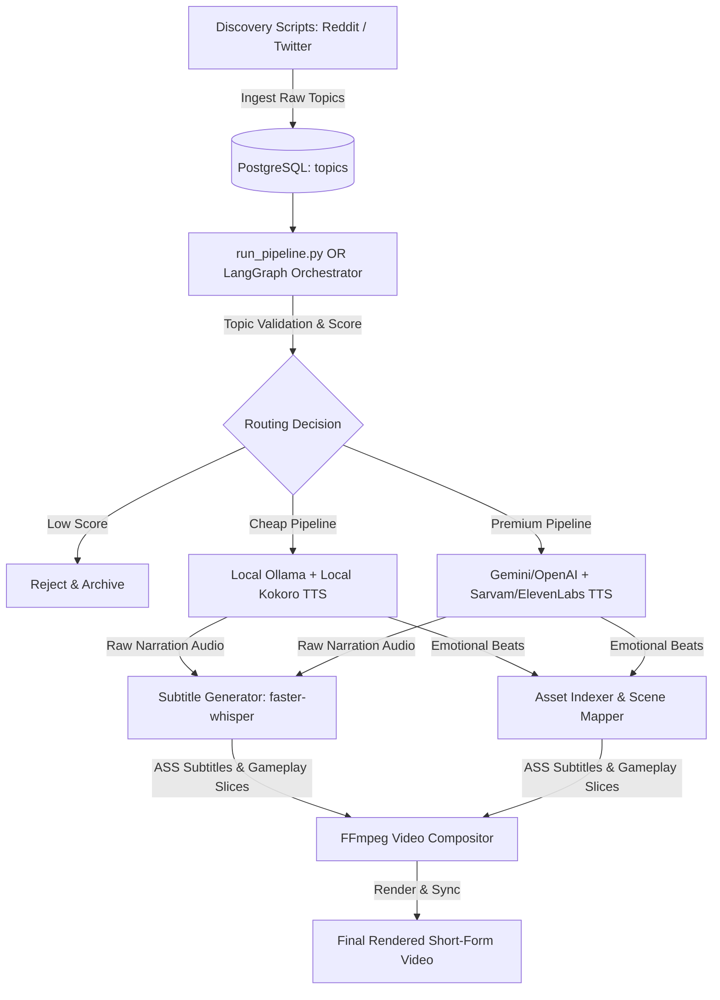

# Setup & Execution Guide: Zem Media Engine

This guide provides a comprehensive, step-by-step walkthrough to get the **Zem Autonomous Media Engine** up and running on your local machine, from system prerequisites to full video production.

---

## 🏗️ System Architecture Overview

Zem works as an Autonomous Media Operating System. Understanding how data flows through the application will help you run and debug it:



---

## 📋 Step 1: System Prerequisites

Before starting, ensure the following software is installed on your host system:

### 1. Python 3.10 or 3.11
Verify your Python installation:
```bash
python --version
```

### 2. External System Binaries
Zem relies on native binaries for audio processing, phonemization, and video composition:

*   **FFmpeg & FFprobe**: Essential for rendering, scaling, and subtitle burning.
    *   *Windows*: Run `winget install Gyan.FFmpeg` or download from Gyan.dev and add the `bin/` folder to your System PATH.
    *   *Ubuntu/Debian*: `sudo apt update && sudo apt install -y ffmpeg`
    *   *macOS*: `brew install ffmpeg`
*   **eSpeak NG + dev headers**: Required by the local `kokoro` TTS library for text phonemization. Both the runtime binary and the development headers (`libespeak-ng-dev`) are needed to compile the `phonemizer` Python package.
    *   *Windows*: Download and run the [.msi installer from the eSpeak NG GitHub releases page](https://github.com/espeak-ng/espeak-ng/releases). Add the install path (e.g., `C:\Program Files\eSpeak NG`) to your System PATH.
    *   *Ubuntu/Debian*: `sudo apt-get install -y espeak-ng libespeak-ng-dev`
    *   *macOS*: `brew install espeak`
*   **libGL** (`libgl1`): Required by `opencv-python` for video frame processing.
    *   *Ubuntu/Debian*: `sudo apt-get install -y libgl1`
    *   *macOS / Windows*: Included with the system OpenGL drivers — no action needed.

### 3. Docker (For Database & Message Queues)
Required to run PostgreSQL and Redis in containers. Install [Docker Desktop](https://www.docker.com/products/docker-desktop/) (Windows/macOS) or Docker Engine (Linux).

---

## 🛠️ Step 2: Bootstrapping & Installation

Zem uses a virtual environment to manage dependencies locally.

### 1. Initialize Virtual Environment & Install Dependencies
Open a terminal in the project root directory (`Zem`) and run:
```powershell
# Create virtual environment
python -m venv .venv

# Activate virtual environment
# Windows (PowerShell):
.venv\Scripts\Activate.ps1
# Windows (CMD):
.venv\Scripts\activate.bat
# Linux / macOS:
source .venv/bin/activate

# Install PyTorch CPU-only FIRST to avoid pulling the multi-GB CUDA wheel from PyPI
pip install torch==2.2.1 --index-url https://download.pytorch.org/whl/cpu

# Install all remaining packages
pip install -r requirements.txt
```

> [!IMPORTANT]
> `torch` must be installed from the PyTorch CPU index **before** `requirements.txt`. The `torch` line in `requirements.txt` is intentionally commented out to prevent pip from re-downloading the CUDA wheel and overwriting the CPU-only install.

### 2. Run the Bootstrap Tool
Run the automatic initialization script:
```bash
.venv\Scripts\python.exe scripts/bootstrap_environment.py
```
This script will:
*   Auto-generate all asset and temporary directories (`assets/fonts`, `assets/videos/gameplay`, `assets/audio/raw`, etc.).
*   Copy `.env.example` to `.env` (if not already present).
*   Verify that `FFmpeg` and `FFprobe` are correctly configured in your system path.

---

## ⚙️ Step 3: Configure Environment Variables

Open the generated `.env` file in the root directory and configure your credentials:

1.  **Local-First / Free Mode (Recommended for testing)**:
    *   Set `ENABLE_OLLAMA=false` (unless you have Ollama running locally).
    *   Set `ENABLE_KOKORO=true` (local high-speed TTS).
    *   Set `LANGGRAPH_CHECKPOINT_BACKEND=memory` (bypasses Redis for simple pipeline runs).
2.  **API Keys (If enabling cloud capabilities)**:
    *   If using Gemini (for premium LLM workflows): Set `ENABLE_GEMINI=true` and add your `GOOGLE_API_KEY`.
    *   If using Sarvam (for premium multilingual TTS): Set `ENABLE_SARVAM=true` and add your `SARVAM_API_KEY`.
3.  **Local Kokoro Path (For air-gapped/offline inference)**:
    *   Download `kokoro-v0_19.pth` and `config.json` from [Hugging Face](https://huggingface.co/hexgrad/Kokoro-82M).
    *   Place them in a directory (e.g., `assets/models/kokoro/`).
    *   Set `KOKORO_MODEL_PATH=assets/models/kokoro/` in `.env` to load weights from disk rather than downloading them on startup.

---

## 🗄️ Step 4: Start Infrastructure Services

Before executing migrations or running queue-based workers, launch the database and message broker:

```bash
# Start Postgres and Redis in the background
docker compose -f infra/docker/docker-compose.yml up -d
```

Verify the containers are running:
```bash
docker ps
```
*(You should see `zem_postgres` running on port `5432` and `zem_redis` running on port `6379`.)*

---

## 🎨 Step 5: Place Gameplay Background Footage

To successfully compose a video, the FFmpeg engine requires source background footage (e.g. Minecraft parkour, Subway Surfers, satisfying videos):

1.  Download some 1080p vertical/horizontal gameplay loop clips.
2.  Place them in the **`assets/videos/gameplay/`** directory.
3.  *(Optional)* Download a `.ttf` or `.otf` custom font (e.g., Montserrat, Inter) and place it in **`assets/fonts/`** for styled subtitle rendering.

---

## 🏃 Step 6: Running the Application

There are three primary ways to run the Zem system: **Direct Pipeline Gateway** (the master entrypoint `main.py`), **Distributed Worker Mode** (best for background queue processing), and **Containerized Mode** (Docker Compose).

---

### Path A: Direct Pipeline Gateway (Recommended CLI)

The unified entrypoint **`main.py`** bootstraps, validates, and runs the entire pipeline synchronously, streaming execution logs in real-time.

#### 1. Run Pre-Flight Diagnostics Check
To perform a complete diagnostics test on libraries, configurations, binaries, and model paths:
```bash
.venv\Scripts\python.exe main.py --check
```

#### 2. Ingest Trending Topics
Choose one of the ingestion engines to populate topics in the database:

*   **Twitter Ingestion**: Ingests, clusters, and ranks live viral hashtags/posts:
    ```bash
    .venv\Scripts\python.exe scripts/run_twitter_discovery.py
    ```
*   **Reddit Ingestion**: Ingests hot threads from subreddits configured in `settings.py`:
    ```bash
    .venv\Scripts\python.exe scripts/run_content_discovery.py
    ```

#### 3. Execute the Master Pipeline Gateway
Once topics exist, run the main gateway to render a video:
```bash
.venv\Scripts\python.exe main.py --topic topic_reddit_gaming_001
```
*Optional parameters:*
*   `--force-score 85`: Forces a content virality score (e.g. to test the premium routing path).

---

### Path B: Asynchronous Worker Mode (Production Queues)

This mode splits ingestion, scheduling, and rendering into isolated background processes managed by Redis Queue.

#### 1. Launch the Workers
Open two separate terminal windows (with virtual environment active) and run:

*   **Window 1: Start Asynchronous Job Worker** (handles script generation, voice-over generation, transcription):
    ```bash
    .venv\Scripts\python.exe scripts/run_worker.py
    ```
*   **Window 2: Start Isolated Render Worker** (handles heavy FFmpeg encoding/compiling in its own thread block):
    ```bash
    .venv\Scripts\python.exe scripts/run_render_worker.py
    ```

#### 2. Schedule a Pipeline Job
You can queue ingestion or routing jobs. To test queueing a video compilation job, run:
```bash
# Triggers pipeline checks and submits task jobs to RQ queues
.venv\Scripts\python.exe scripts/run_pipeline.py --async
```

#### 3. Monitor Execution in Real-Time
Open a third terminal window to monitor queue size, worker status, and jobs:
```bash
.venv\Scripts\python.exe scripts/monitor_queues.py --watch
```

---

### Path C: Containerized Mode (Docker Compose)

This mode runs the entire stack (database, broker, background worker, and render worker) inside isolated Docker containers, eliminating host dependency installation requirements like `ffmpeg` or `espeak-ng`.

#### 1. Build and Start the Stack
Navigate to the root directory and run:
```bash
docker compose -f infra/docker/docker-compose.yml up -d --build
```
This builds your local application image and starts all services in the background. The Dockerfile installs the following system dependencies inside the container automatically:
- `ffmpeg` — video compositor
- `espeak-ng` + `libespeak-ng-dev` — Kokoro TTS phonemization (binary + compile headers)
- `libsndfile1` — C library for `soundfile` Python package
- `libgl1` — OpenGL shared library required by `opencv-python`

PyTorch is installed CPU-only (`--index-url https://download.pytorch.org/whl/cpu`) as a dedicated layer before `requirements.txt` to keep the image size minimal and avoid CUDA wheel downloads.

#### 2. Run Commands Inside the Container
To execute pipelines or trigger ingestion manually:
*   **Run pre-flight checks inside container**:
    ```bash
    docker compose -f infra/docker/docker-compose.yml exec worker python -c "import asyncio; from shared.validation.environment_validator import EnvironmentValidator; asyncio.run(EnvironmentValidator().generate_health_report())"
    ```
*   **Ingest Twitter trends inside container**:
    ```bash
    docker compose -f infra/docker/docker-compose.yml exec worker python scripts/run_twitter_discovery.py
    ```
*   **Execute pipeline rendering inside container**:
    ```bash
    docker compose -f infra/docker/docker-compose.yml exec worker python scripts/run_pipeline.py
    ```

#### 3. View Logs & Monitoring
*   Monitor background jobs and processing logs:
    ```bash
    docker compose -f infra/docker/docker-compose.yml logs -f worker render_worker
    ```
*   Run the queue monitor inside a container:
    ```bash
    docker compose -f infra/docker/docker-compose.yml exec worker python scripts/monitor_queues.py --watch
    ```

---

## 🧪 Step 7: Verifying System Stability

To ensure that routing abstractions and external libraries are functional, run the verification suites:

### 1. Pre-Flight Health Report
Generates a comprehensive checklist of all dependencies, paths, and databases:
```bash
.venv\Scripts\python.exe -c "import asyncio; from shared.validation.environment_validator import EnvironmentValidator; asyncio.run(EnvironmentValidator().generate_health_report())"
```

### 2. Provider Routing Unit Tests
Ensures capability management is functioning as expected:
```bash
.venv\Scripts\python.exe scripts/test_local_first_routing.py
```

### 3. Subtitle Formatting Tests
Checks subtitle alignments and styling rules:
```bash
.venv\Scripts\python.exe scripts/test_subtitle_formatter.py
```

---

## 🧹 Maintenance & Cleanup

To free up local space and archive finished materials:
*   Run the cleanup script to archive/delete temporary assets older than 24 hours:
    ```bash
    .venv\Scripts\python.exe scripts/run_audio_cleanup.py
    ```
*   If jobs get stuck in queues, purge dead jobs:
    ```bash
    .venv\Scripts\python.exe scripts/purge_dead_jobs.py
    ```
